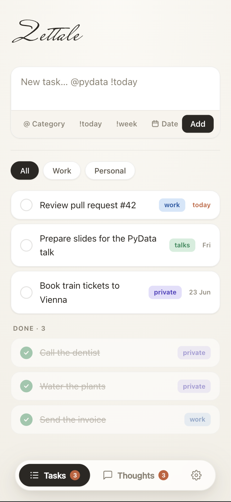
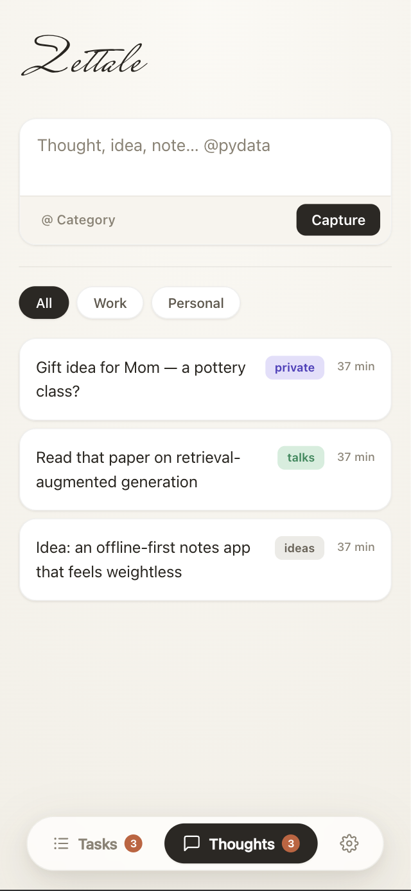
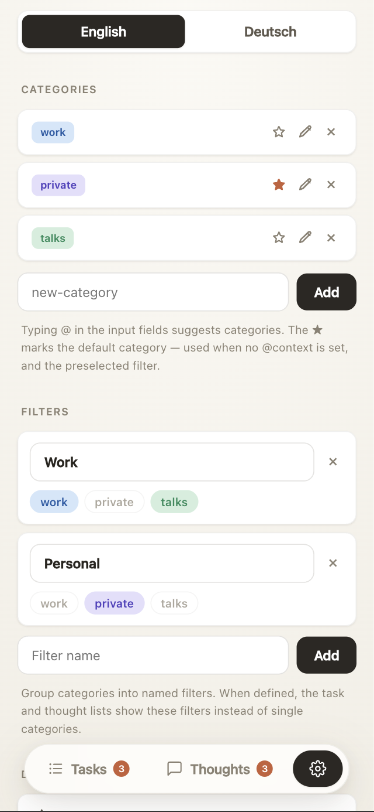

<div align="center">

# Zettale

**A featherweight todo &amp; notes app you actually own.**

Quick-capture tasks and fleeting thoughts, sort them later, sync across all your
devices — self-hosted, offline-first, no accounts, no tracking, no bloat.

<p>
  
  
  
</p>

</div>

---

## Why Zettale

It's deliberately **small**. No framework, no build step, no npm install, no
tracking, no cloud account — just a single HTML file and a tiny API.

- **🪶 Featherweight** — the whole frontend is a single ~70 KB `index.html` of
  vanilla JS (no framework, no build). The backend is one `main.py` (FastAPI) on
  SQLite. Runs happily on the cheapest VPS.
- **📲 Installable PWA** — add it to your home screen; it opens like a native app
  in its own window.
- **✈️ Offline-first** — capture tasks with no connection; they queue locally and
  sync the moment you're back online.
- **⚡ Quick capture** — type `Call the dentist @private !today`. Inline `@context`
  for categories, `!today` / `!week` or a date picker for deadlines.
- **🧠 Tasks *and* thoughts** — a separate inbox for ideas and notes you can later
  turn into a task, archive, or drop.
- **🗂 Your structure** — custom categories and named filter groups, synced across
  devices and editable any time.
- **🌗 Light &amp; dark, 🇬🇧/🇩🇪** — system-aware themes and an English/German UI.

> The name is Carinthian dialect for *"little note"* — a `Zettel` you jot
> something on and don't think twice about.

---

## What's inside

```
todo-pwa/
├── backend/        FastAPI + SQLite — the whole API in one main.py
└── frontend/       Static PWA: index.html + sw.js + manifest + font + icons
```

No bundler, no node_modules. The frontend is served as plain static files.

---

## Run locally (for testing)

**Backend:**
```bash
cd backend
python3 -m venv .venv && source .venv/bin/activate
pip install -r requirements.txt
export TODO_TOKEN="$(openssl rand -hex 24)"   # keep it!
export TODO_ORIGINS="http://localhost:8012"   # your frontend URL
uvicorn main:app --port 8001
```

**Frontend** (any static server):
```bash
cd frontend && python3 -m http.server 8012
```

Open `http://localhost:8012` → on first launch enter the API URL
(`http://localhost:8001`) and the token. Both are stored only in the browser
(localStorage), never in code.

API: `GET/POST /tasks`, `PATCH/DELETE /tasks/{id}`, `GET/POST /thoughts`,
`PATCH /thoughts/{id}`, `PATCH /thoughts/{id}/archive`, `DELETE /thoughts/{id}`,
`GET/PUT /settings`, `POST /settings/rename-context`, `GET /export` (todo.txt),
`GET /health`. Everything except `/health` needs `Authorization: Bearer <TOKEN>`.

---

## Deploy with Docker

Two small containers (`docker-compose.yml`):

- **api** — FastAPI/uvicorn, SQLite on a named volume (`todo-data`).
- **web** — nginx serving the static PWA and proxying `/api/*` to the backend.

TLS and the public hostname are handled by a reverse proxy **in front** of this.
The compose file joins `web` to an existing
[Nginx Proxy Manager](https://nginxproxymanager.com/) network so NPM can route a
domain to it and manage the Let's Encrypt certificate — no Apache, no certbot
wrangling.

```bash
cp .env.example .env     # set DOMAIN, TODO_TOKEN, NPM_NETWORK
docker compose up -d --build       # (older Docker: docker-compose)
```

Then in Nginx Proxy Manager add a **Proxy Host**:

- Domain: `todo.yourserver.com`
- Forward to: `zettale-web` on port `80` (scheme `http`)
- SSL tab: request a new Let's Encrypt cert, force SSL

Open `https://todo.yourserver.com`, then enter the API URL
`https://todo.yourserver.com/api` and your token on first launch.

> No reverse proxy yet? The git history has a self-contained nginx + certbot
> variant; ping me if you'd rather run it standalone.

### Install on your phone

Open the site in Chrome/Safari → **Add to Home Screen**. It runs as a
standalone, offline-capable app. Categories and filters sync across every device
you install it on.

---

## Good to know

- **Due dates** — stored as ISO dates. Lists sort by due date, then by creation
  date (oldest first). Tap a task to edit its text and deadline.
- **Categories &amp; filters** — managed in Settings, stored in the database and
  synced across devices. Group categories into named filters; the lists then
  show those filters instead of single categories.
- **Privacy** — single-user, bearer-token auth, everything on your own server.
  No third parties.

## Extendable later (without a rewrite)

- **Multi-user (read-only viewer):** `users` table + `owner_id` on `tasks`,
  static token → per-user token.
- **Recurring tasks:** `rec` field + a cron job or lazy re-create on check-off.
